# HelpDesk AI

HelpDesk AI is a full-stack support operations POC built with .NET 8, EF Core/SQL Server, Angular 22, Angular Material, Chart.js, JWT authentication, and pluggable LLM providers (OpenAI, Grok, Gemini, Claude).

## Visual guide

- [Product overview](#product-overview)
- [Dashboard explained](#dashboard-explained)
- [Ticket queue and creation](#ticket-queue-and-creation)
- [Ticket detail workspace](#ticket-detail-workspace)
- [Authentication and permissions](#authentication-and-permissions)
- [Architecture and data model](#architecture-and-data-model)
- [AI flow](#ai-flow)
- [Backend setup](#backend-setup) · [Frontend setup](#frontend-setup) · [Demo accounts](#seeded-demo-accounts)
- [API reference](#api-reference)

The illustrations below are **annotated feature maps**, not browser screenshots. Dashboard numbers represent the initial six-ticket seed; the app displays current database values. Mermaid diagrams render in GitHub and Markdown viewers with Mermaid support. The screen illustrations are local SVG files and do not require Mermaid.

## Product overview

HelpDesk AI is a shared workspace for support staff. Agents record customer issues, triage the queue, collaborate through internal comments, and prepare AI-assisted reply drafts. Admins also assign ownership and can delete tickets through the API.

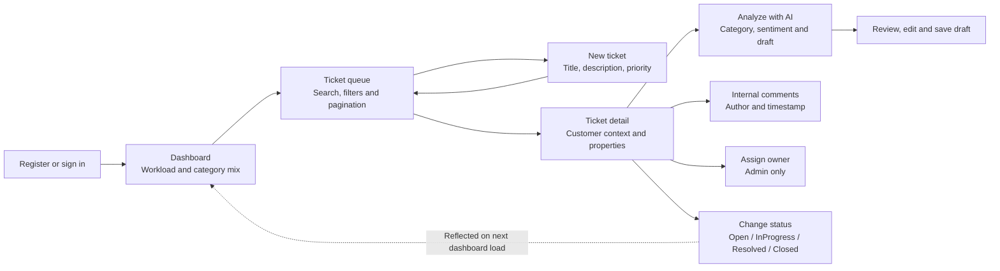

**Typical demo:** sign in as the seeded Admin, inspect the dashboard, open the queue, create a ticket, assign an owner, run AI analysis, edit and save the reply draft, add a comment, then mark the ticket Resolved.

## Dashboard explained

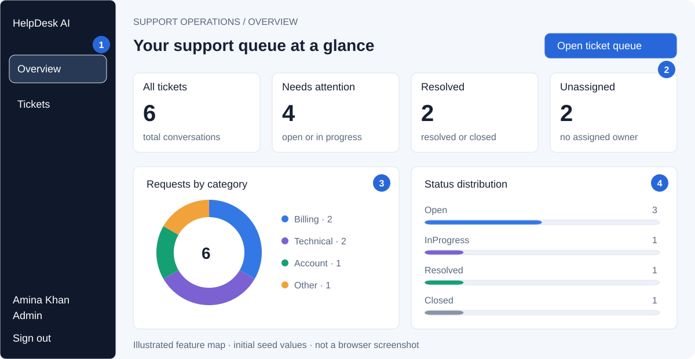

| Marker | Feature | What it tells you |
|---|---|---|
| **1** | Navigation and signed-in user | **Overview** opens the dashboard; **Tickets** opens the queue. The sidebar identifies the current user and role and provides Sign out. |
| **2** | Summary cards | **All tickets** counts every record. **Needs attention** combines Open and InProgress. **Resolved** combines Resolved and Closed. **Unassigned** counts every ticket without an owner, regardless of status. |
| **3** | Category doughnut | Shows the ticket count for Billing, Technical, Account and Other where records exist. Category describes the issue type, independently of priority or status. |
| **4** | Status distribution | Shows a count and proportional bar for each status present in the database. Bar width is status count divided by the total ticket count. |

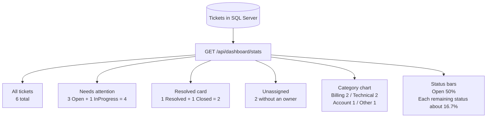

Statistics load when the dashboard route opens; there is no polling or push subscription. The cards and charts are summaries, not clickable filters. **Open ticket queue** takes you to the full ticket list.

## Ticket queue and creation

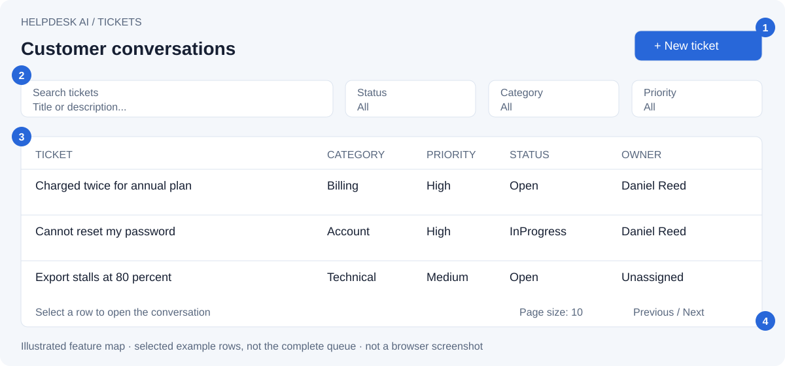

| Marker | Feature | How to use it |
|---|---|---|
| **1** | New ticket dialog | Enter a title, description and priority, then select **Create ticket**. The dialog validates required fields and length limits before submission. A successful creation refreshes the queue and clears filters. |
| **2** | Search and combined filters | Search matches title or description without case sensitivity after a 300 ms typing pause. Status, category and priority filters combine with search. Changing a filter starts again at page one. |
| **3** | Material table | Rows show title, description preview, category, priority, status, owner and created time. Newest tickets appear first. Select a row or title to open the detail page. |
| **4** | Server pagination | Choose 5, 10 or 25 rows per page. The server returns only that page plus the total matching count. The default is 10. |

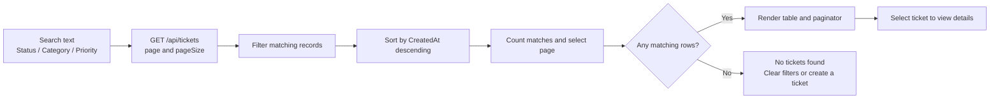

### Creating and progressing a ticket

| Input | Rule / initial behavior |
|---|---|
| Title | Required; maximum 160 characters. |
| Description | Required; maximum 5,000 characters. |
| Priority | Low, Medium, High or Urgent; the dialog defaults to Medium. |
| Status | New tickets start as Open. |
| Category | New tickets start as Other; update manually or run AI analysis. |
| Assignment | New tickets have no assigned owner. |
| AI fields | Sentiment and suggested reply are initially empty. Analysis is triggered explicitly. |

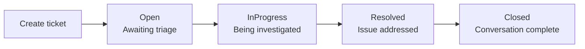

This is a **suggested team workflow**, not an enforced transition sequence. The current status dropdown and API allow selecting any of the four statuses directly.

## Ticket detail workspace

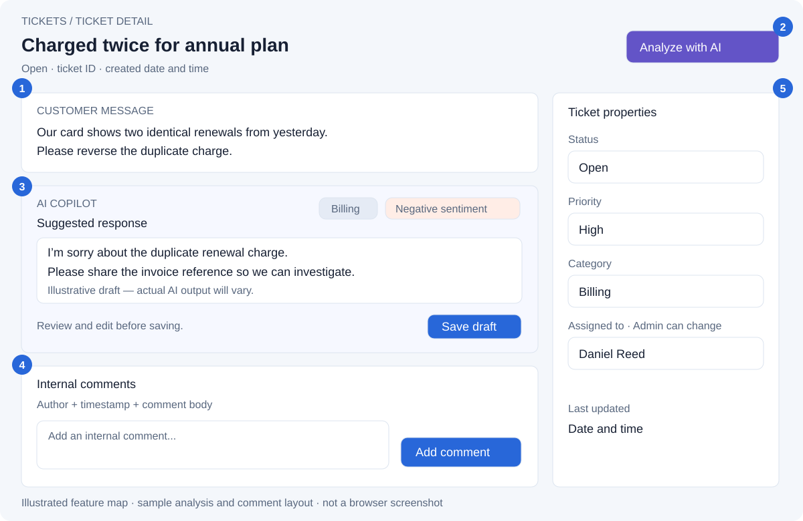

| Marker | Feature | Detailed behavior |
|---|---|---|
| **1** | Customer context | Displays the complete title and description, status, shortened ticket ID and creation time. The description is the original issue context used by AI. |
| **2** | Analyze with AI | A dropdown lets you choose the LLM provider (OpenAI, Grok, Gemini or Claude); the selection calls the backend for this ticket. A spinner replaces the button label and prevents another click while the request is pending. A successful response updates category, sentiment and suggested reply. |
| **3** | Editable suggested reply | Shows the AI category and sentiment badges alongside an editable draft. **Save draft** persists edits. Saving a draft does not send an email or message to the customer. |
| **4** | Internal comments | Adds a required comment up to 2,000 characters. Each comment records the signed-in author and creation time. The detail endpoint loads comments chronologically. These are internal notes, not customer replies. |
| **5** | Ticket properties | Changing status, priority or category saves immediately through the API. Admins can choose an owner from the assignment dropdown; Agents see the disabled ownership control. Last updated reflects saved ticket changes. |

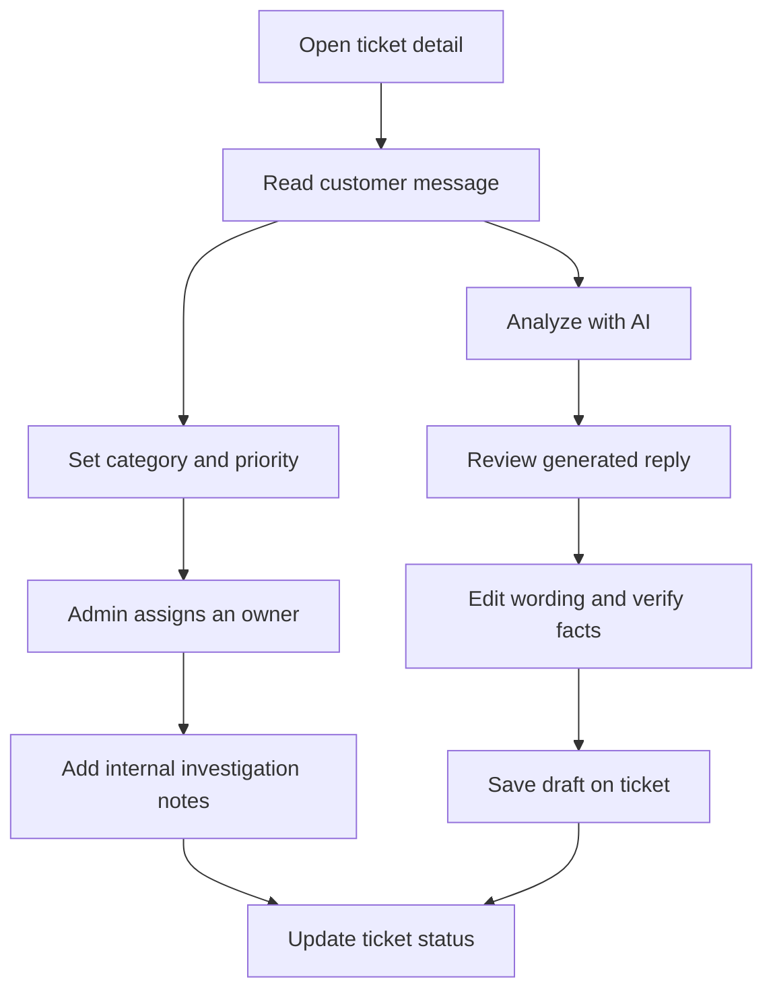

### Category, priority, status and sentiment are different

| Field | Answers | Values | Updated by |
|---|---|---|---|
| Category | What kind of issue is this? | Billing, Technical, Account, Other | Staff or AI analysis |
| Priority | How urgent is the work? | Low, Medium, High, Urgent | Staff |
| Status | Where is the work in the process? | Open, InProgress, Resolved, Closed | Staff |
| Sentiment | What tone does the customer express? | Positive, Neutral, Negative | AI analysis; nullable before analysis |

For example, a duplicate charge can be **Billing / High / Open / Negative**. These labels describe different dimensions of the same ticket.

**Current UI boundaries:** the API supports editing title and description and deleting a ticket; the Angular detail view does not yet expose those controls. Assignment can select another user but the UI does not currently persist an unassignment. The owner endpoint currently lists all users, including Admins. Re-running AI analysis replaces the previously stored category, sentiment and draft.

## Authentication and permissions

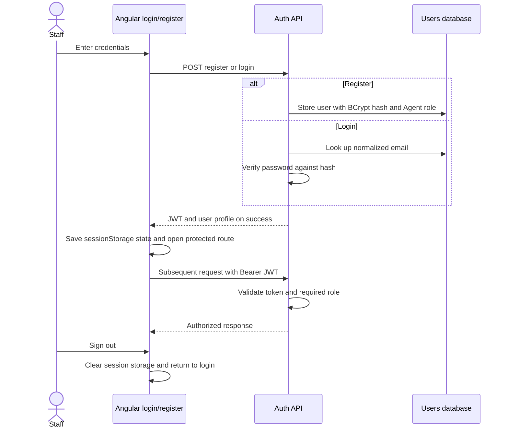

Registration requires a name, a valid email and a password of at least eight characters containing an uppercase letter and a number. Email addresses are normalized on the backend. Duplicate emails return a conflict response; incorrect credentials return an authentication error.

| Capability | Agent | Admin | Access |
|---|---|---|---|
| Dashboard and ticket search/detail | Yes | Yes | UI and API |
| Create ticket | Yes | Yes | UI and API |
| Update category, priority and status | Yes | Yes | UI and API |
| Run AI analysis / save reply draft | Yes | Yes | UI and API |
| Add internal comments | Yes | Yes | UI and API |
| Assign owner | No | Yes | UI and API |
| Edit title or description | Yes | Yes | API |
| Delete ticket | No | Yes | API |

The route guard redirects signed-out users to login. The interceptor attaches the JWT to HTTP requests; the backend enforces roles independently of the UI. A 401 response from a protected endpoint clears the client session and returns to login. Session storage is accessible to JavaScript and is not an HttpOnly cookie. This POC has no refresh-token flow or server-side logout revocation.

## Solution structure

```text
HelpDeskAI.sln
├── backend/src
│   ├── HelpDeskAI.Api             HTTP controllers, JWT pipeline, Swagger, middleware
│   ├── HelpDeskAI.Application     use cases, DTOs, validators, mapping, interfaces
│   ├── HelpDeskAI.Domain          entities and domain enums
│   └── HelpDeskAI.Infrastructure  EF Core, repositories, identity, AI providers, seeding
└── frontend/helpdesk-ai           standalone Angular application
    └── src/app
        ├── core                   API/auth services, guard, interceptors, models, environment config
        └── features               auth, dashboard, ticket list/detail workflows
```

Dependencies point inward: Domain has no project dependencies; Application depends on Domain; Infrastructure implements Application contracts; API composes the application. Angular lazy-loads each feature route and accesses the backend only through the central `ApiService`.


## Architecture and data model

### Runtime request flow

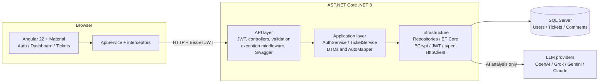

Runtime calls travel outward through repository and service implementations, while source-code dependencies point toward the inner layers. Application depends on interfaces and does not know the database provider or HTTP implementation.

### Project dependencies

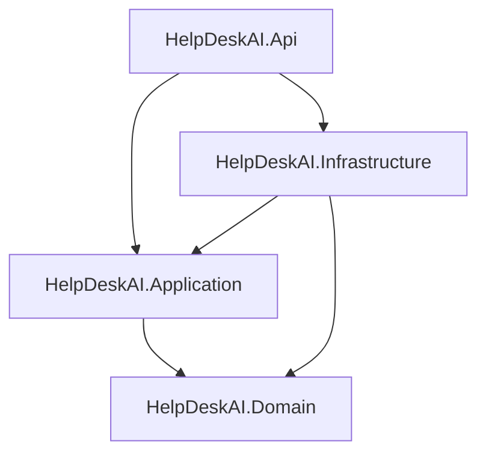

| Layer | Responsibility | Representative files |
|---|---|---|
| API | HTTP routes, authorization, validation responses, middleware and dependency composition | [Program.cs](backend/src/HelpDeskAI.Api/Program.cs), [TicketsController.cs](backend/src/HelpDeskAI.Api/Controllers/TicketsController.cs) |
| Application | Ticket and authentication use cases, DTOs, validation rules and repository/service contracts | [TicketService.cs](backend/src/HelpDeskAI.Application/Services/TicketService.cs), [validators](backend/src/HelpDeskAI.Application/Validation/RequestValidators.cs) |
| Domain | User, Ticket, Comment and their enums | [entities](backend/src/HelpDeskAI.Domain/Entities), [enums](backend/src/HelpDeskAI.Domain/Enums/TicketEnums.cs) |
| Infrastructure | EF Core persistence, migrations, seeding, password hashing, JWT generation and per-provider LLM HTTP clients | [repositories](backend/src/HelpDeskAI.Infrastructure/Persistence/Repositories.cs), [AiTicketServiceBase.cs](backend/src/HelpDeskAI.Infrastructure/AI/AiTicketServiceBase.cs), [OpenAiTicketService.cs](backend/src/HelpDeskAI.Infrastructure/AI/OpenAiTicketService.cs) |
| Frontend | Routed screens, forms, Material table, charts, client session and HTTP integration | [features](frontend/helpdesk-ai/src/app/features), [core services](frontend/helpdesk-ai/src/app/core) |

### Entity relationships

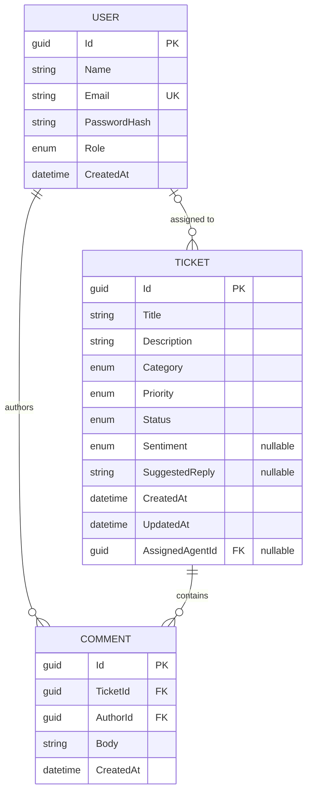

A ticket may be unassigned or have one owner. A user can own many tickets and author many comments. Every comment belongs to one ticket and one author. Deleting a ticket also deletes its comments. There is no separate customer entity or customer-facing portal in this POC.

### Database startup

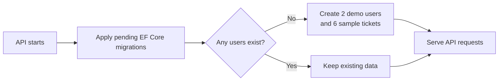

Seeding occurs only when the user table is empty. Existing databases are not reset on startup. The checked-in configuration and migration target SQL Server; the connection string defaults to a local SQL Server LocalDB instance and can point at any SQL Server.

## Prerequisites

- .NET 8 SDK
- SQL Server (LocalDB ships with Visual Studio; any SQL Server instance works by changing the connection string)
- Node.js 22.22.3+ or 24.15+
- npm 10+ (bundled with Node.js)
- An API key for at least one LLM provider (OpenAI, Grok, Gemini, or Claude) only when using **Analyze with AI**

## Backend setup

From the repository root:

```powershell
dotnet restore HelpDeskAI.sln --configfile NuGet.Config
# Set a key for whichever provider(s) you plan to use with Analyze with AI:
dotnet user-secrets set --project backend/src/HelpDeskAI.Api "OpenAI:ApiKey" "YOUR_OPENAI_API_KEY"
dotnet user-secrets set --project backend/src/HelpDeskAI.Api "Grok:ApiKey" "YOUR_GROK_API_KEY"
dotnet user-secrets set --project backend/src/HelpDeskAI.Api "Gemini:ApiKey" "YOUR_GEMINI_API_KEY"
dotnet user-secrets set --project backend/src/HelpDeskAI.Api "Claude:ApiKey" "YOUR_CLAUDE_API_KEY"
dotnet run --project backend/src/HelpDeskAI.Api --launch-profile http
```

The API runs at `http://localhost:5006`; Swagger is at `http://localhost:5006/swagger`. On first run EF Core applies the checked-in migration, creates the `HelpDeskAI` database on the configured SQL Server instance, and seeds demo data.

The default connection string targets SQL Server LocalDB (`Server=(localdb)\MSSQLLocalDB;Database=HelpDeskAI;...`); repoint `ConnectionStrings:DefaultConnection` at another SQL Server instance if you prefer. A development `Jwt:Key` is already set in `appsettings.json`, so the API runs without extra setup — override it with a private key in any real deployment.

Environment variables work as an alternative to user-secrets:

```powershell
$env:OPENAI__APIKEY="YOUR_OPENAI_API_KEY"
$env:JWT__KEY="a-long-random-signing-key-of-at-least-32-characters"
```

The local development `Jwt:Key` in `appsettings.json` is only a convenience for running the POC; never reuse it in a real deployment, and do not commit LLM provider keys. For production, provide the connection string, JWT key, LLM provider keys/models, allowed frontend origin, and HTTPS settings through the deployment secret/configuration system. AutoMapper 15+ also requires a commercial `AutoMapper:LicenseKey` for production deployment; development and testing are permitted without one.

## Frontend setup

In a second terminal:

```powershell
cd frontend/helpdesk-ai
copy .env.example .env
npm install
npm start
```

The API base URL is read from `.env` (`NG_APP_API_BASE_URL`, defaulting to `http://localhost:5006/api`) by `@ngx-env/builder`. `.env` is git-ignored, so copy `.env.example` to `.env` and adjust it per machine; only variables prefixed with `NG_APP_` are exposed to the browser bundle.

Open `http://localhost:4200`. The JWT is held in `sessionStorage`, so it is cleared when the browser session ends. In a production system, pair the SPA with a backend-for-frontend and `HttpOnly`, `Secure`, `SameSite` cookies when the deployment topology permits it.

## Seeded demo accounts

| Role | Email | Password |
|---|---|---|
| Admin | `admin@helpdesk.local` | `Admin123!` |
| Agent | `agent@helpdesk.local` | `Agent123!` |

Registered users receive the Agent role. Only Admin users can assign agents or delete tickets; both roles can manage ticket content, comments, and AI analysis.

## AI flow

**Analyze with AI** is a dropdown: staff choose which LLM provider runs the analysis — **OpenAI**, **Grok**, **Gemini**, or **Claude**. The chosen provider is sent to the backend, which resolves the matching service and calls that provider's API.

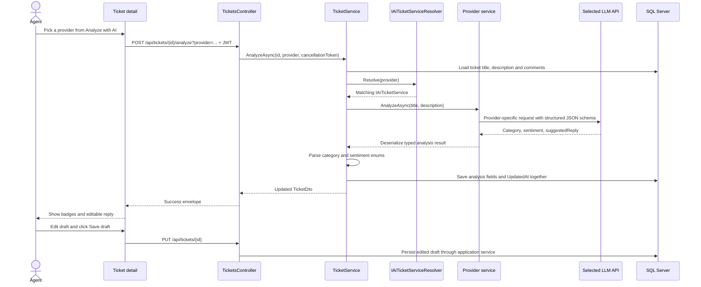

### What the AI does

| Output | Example | How the app uses it |
|---|---|---|
| Category | Billing | Updates the ticket category and subsequent category statistics. |
| Sentiment | Negative | Adds a tone badge on the ticket detail page. |
| Suggested reply | Acknowledge a duplicate charge and ask for an invoice reference. | Stores an editable draft for staff to review. No outbound message is sent. |

The provider receives the title, description and any internal comments on the ticket, not passwords or the full user profile. Instructions ask it to acknowledge the issue, avoid invented facts and suggest a next step. A structured JSON schema limits category and sentiment to the supported values. AI classification and reply wording can still be wrong; staff should review the result.

Each typed client has a 45-second timeout and passes the cancellation token to network calls. Transient provider responses (HTTP 429, 500, 502, 503, 504) and network errors are retried up to three times with a short backoff. Missing configuration and other handled provider/network/JSON failures become a 502 response with a message shown by the frontend. There is no mock fallback, streaming, or automatic analysis on creation.

### Providers

API keys never reach the browser; every provider is configured server-side. Each provider is a separate `IAiTicketService` in `Infrastructure/AI`, sharing one base pipeline (`AiTicketServiceBase`) and selected at request time by `IAiTicketServiceResolver`. Every provider has its own configuration section with `ApiKey`, `Model` and `BaseUrl`; if a provider's `ApiKey` is not set, its analysis request returns a 502 with a clear "not configured" message.

| Provider | Config section | Default model | Provider API |
|---|---|---|---|
| OpenAI | `OpenAI` | `gpt-5.6-luna` | Chat Completions |
| Grok (xAI) | `Grok` | `grok-4` | OpenAI-compatible chat completions |
| Gemini (Google) | `Gemini` | `gemini-3.6-flash` | `generateContent` |
| Claude (Anthropic) | `Claude` | `claude-sonnet-4-5` | Messages API |

Set each key with user-secrets or environment variables (for example `OpenAI__ApiKey`, `Grok__ApiKey`, `Gemini__ApiKey`, `Claude__ApiKey`) and override any `Model` per section. The default model IDs are placeholders; use the current IDs from each provider's catalog.

## Useful commands

```powershell
# Compile all backend projects
dotnet build HelpDeskAI.sln

# Add a migration after a model change
dotnet tool restore
dotnet ef migrations add MigrationName --project backend/src/HelpDeskAI.Infrastructure --startup-project backend/src/HelpDeskAI.Api --output-dir Persistence/Migrations

# Angular production build and tests
cd frontend/helpdesk-ai
npm run build
npm test
```

## API conventions

Controller JSON responses use `{ success, data, message, errors }`; validation errors populate the `errors` dictionary. The exception middleware maps not-found, conflict, authentication, and handled upstream-AI failures to HTTP responses. EF and network operations are asynchronous and accept cancellation tokens.

## API reference

All ticket, dashboard and user-list routes require a JWT with Admin or Agent role unless restricted further below.

| Method and route | Purpose | Success |
|---|---|---|
| `POST /api/auth/register` | Create an Agent account and return token/profile | 201 |
| `POST /api/auth/login` | Verify credentials and return token/profile | 200 |
| `GET /api/dashboard/stats` | Return card totals and chart groupings | 200 |
| `GET /api/tickets` | Search/filter and paginate the queue | 200 |
| `GET /api/tickets/{id}` | Retrieve ticket with owner and comments | 200 |
| `POST /api/tickets` | Create ticket | 201 |
| `PUT /api/tickets/{id}` | Update title, description, category, priority, status and draft | 200 |
| `DELETE /api/tickets/{id}` | Delete ticket and comments; Admin only | 204, no body |
| `POST /api/tickets/{id}/assign` | Assign a user as owner; Admin only | 200 |
| `POST /api/tickets/{id}/comments` | Add an internal comment as the current user | 201 |
| `POST /api/tickets/{id}/analyze?provider=` | Run AI analysis with the chosen provider (`OpenAi`, `Grok`, `Gemini`, `Claude`; defaults to `OpenAi`) and store its result | 200 |
| `GET /api/users/agents` | List available owners; currently returns all users | 200 |

List parameters: `search`, `status`, `category`, `priority`, `assignedAgentId`, `page` and `pageSize`. The assignment filter is available in the API but is not exposed in the current queue UI.

### Loading, empty and error feedback

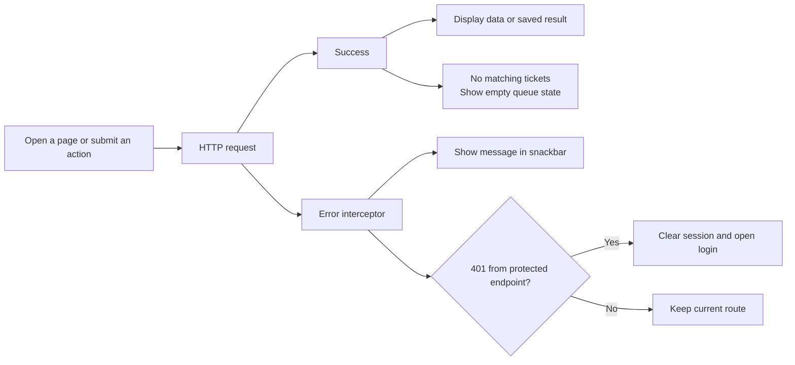

Dashboard, list and detail pages show loading indicators while fetching data. Login, AI analysis, draft saving and comment submission have pending states. Backend validation returns field errors; the current global frontend handler shows the response message, while reactive forms provide local validation.

```json
{
  "success": true,
  "data": {
    "items": [],
    "page": 1,
    "pageSize": 10,
    "totalCount": 0,
    "totalPages": 0
  },
  "message": null,
  "errors": null
}
```

The envelope applies to controller JSON responses and errors handled by the exception middleware. A successful DELETE returns 204 without a body. Authentication challenges and authorization failures can use the framework's default 401/403 response rather than that envelope.
